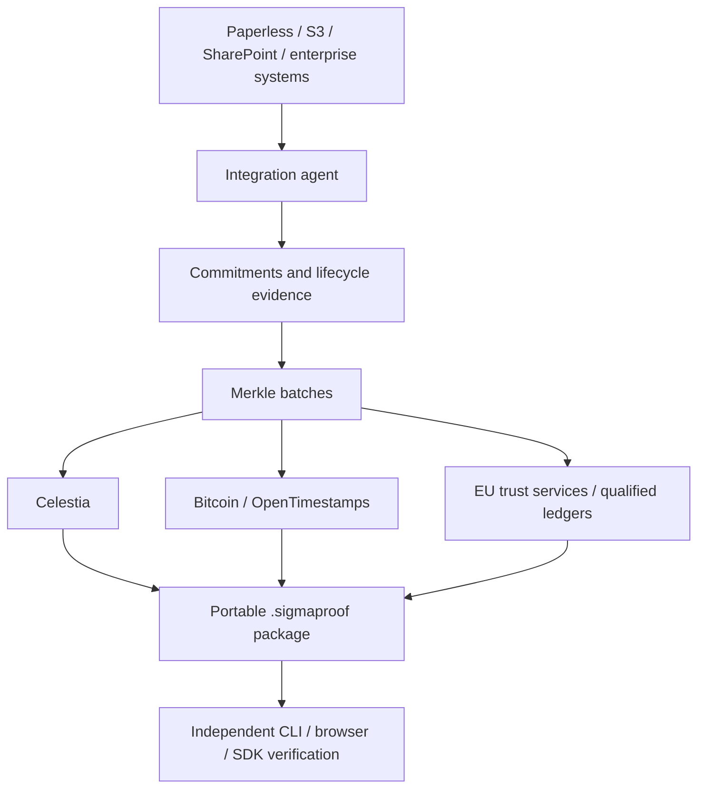

# SigmaProof

**Verifiable digital evidence infrastructure.**

SigmaProof is an open evidence protocol and planned reference implementation for independently verifying the integrity, existence, provenance assertions, and history of digital objects. Documents stay in their existing systems; customers retain portable evidence that can be verified without SigmaProof's servers.

**Status:** architecture and project foundation · **Concept:** v0.2 · **September 2026**

No evidence engine, verifier, integration, or anchor adapter is implemented yet. The specifications are drafts, not an interoperable protocol release. This repository establishes the product, architecture, engineering boundaries, and delivery backlog.

## How it works



Anchors and trust services are parallel providers of different assertions. No particular provider defines the protocol.

## First milestone

Make a Paperless-ngx document independently tamper-evident with a portable proof anchored to Celestia. Verification must succeed after historical blob retrieval is disabled, using preserved proof material and explicitly authenticated anchor state.

## Principles

- Keep authoritative documents in their original systems.
- Publish only opaque randomized commitments; never document contents or identifying metadata.
- Export evidence that belongs to the customer.
- Verify using open specifications without contacting SigmaProof.
- Separate cryptographic validity, anchor authentication, and evidence-policy satisfaction.
- Preserve old evidence and renew it as algorithms and trust systems evolve.

Integrity does not establish that document contents are true, that an uploader was authorized, or that a workflow meets legal requirements. Qualification must be established for the specific trust service; a public blockchain is not automatically a qualified ledger.

## Explore

| Area | Entry point |
| --- | --- |
| Product and scope | [Product brief](docs/product/brief.md) |
| Documentation | [Documentation index](docs/README.md) |
| Architecture | [System architecture](docs/architecture/overview.md) |
| Protocol | [SEP draft index](spec/README.md) |
| Delivery | [Roadmap](ROADMAP.md) and [GitHub milestones](https://github.com/SigmaUno/sigmaproof/milestones) |
| Security | [Threat model](docs/security/threat-model.md) and [reporting](SECURITY.md) |
| Contributing | [Contributor guide](CONTRIBUTING.md) |

## Working locally

Only Python 3.9+ is needed for the documentation checks:

```sh
git clone https://github.com/SigmaUno/sigmaproof.git
cd sigmaproof
make check
```

The planned implementation language is Go. Package directories currently document responsibilities only. There is no daemon to start or production deployment to install.
