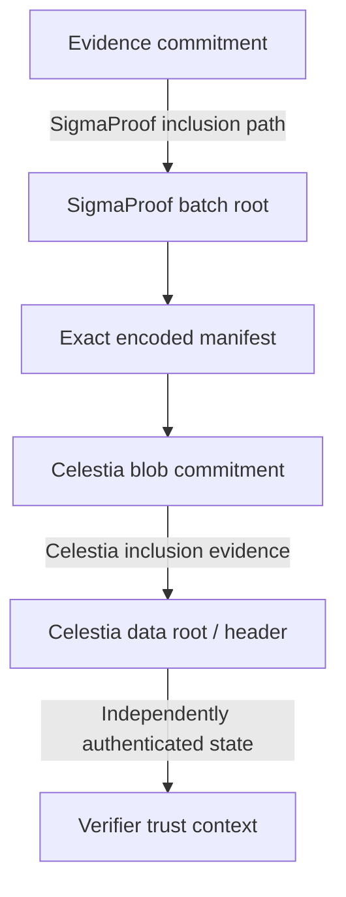

# Celestia anchor and preservation

Status: proposed; proof-capture feasibility is the first engineering gate.

## Two proof domains

A SigmaProof inclusion path proves membership in its batch, not publication on Celestia. The adapter must bind exact manifest bytes to the blob and authenticate their inclusion under the correct network's header.

Celestia distinguishes availability at publication from permanent retrieval. Applications must preserve their own historical data. Light-node sampling/pruning windows are version-dependent; the current documented sampling window is seven days. Do not turn that operational setting into a SigmaProof protocol assumption. See [Celestia retrievability documentation](https://docs.celestia.org/learn/celestia-101/retrievability/) and [light-node settings](https://docs.celestia.org/operate/data-availability/light-node/advanced/).

## Capture requirements

Preserve exact manifest bytes and digest, SigmaProof path with leaf index and tree size, network/chain ID, namespace and namespace version, block height, blob/share format version, commitment, all proof material needed to bind the blob to the data root, relevant headers, and provenance of independently trusted checkpoints. Identify adapter and network protocol versions.

The exact Celestia witness layout must be established against a pinned node/app release and independently exercised. This document intentionally does not label a placeholder `inclusion_proof` field sufficient. Resolve multi-row blobs, share encoding, namespace proofs, header authentication, finality, and checkpoint evolution before freezing SEP-6.

## Long-term authentication

A carried block hash or self-signed history is not an independent trust anchor. Specify how a verifier obtains an authenticated historical checkpoint and how it validates the relevant chain state. Expired light-client trusting periods and long-range attacks are open design issues; preserved header bytes alone do not solve them. Provider/checkpoint replacement must be explicit and policy-visible.

## Acceptance experiment

Capture a real test-network publication, export a complete bundle, then run the independent verifier with all historical blob APIs and SigmaProof services denied. Permit only the documented independently authenticated header/checkpoint input. Verify the original and reject mutated manifest, path, network, namespace, height, commitment, and header. Use a wrong/self-supplied checkpoint as a negative control. Record pinned versions and network trust assumptions.

A mocked proof is useful for unit tests but cannot satisfy this gate. Operating archival infrastructure is optional and must not be required for normal verification.
